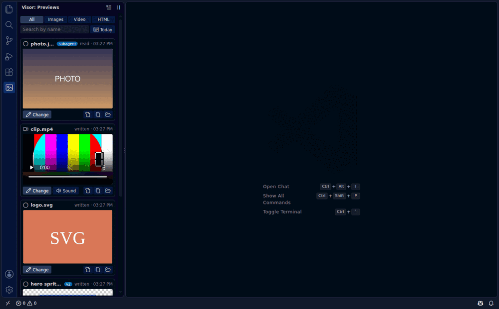

# Visor — media previews for Claude Code

> Unofficial. Not affiliated with Anthropic.

See what Claude Code sees. A side panel in VS Code that shows, live, the **images, SVG, HTML and video** Claude Code reads or creates — including when Claude runs on a remote server over **Remote-SSH**.

Today the official extension shows `[Image]` in the chat: Claude sees the picture, you don't. This fixes that.

## Features

- **Live panel** with everything Claude reads or generates: images, SVG, HTML and video. Includes files created from the terminal (image generators, scripts), by **MCP tools** (fal, Gemini and similar) and by **subagents**. Two Claude sessions in the same project are followed together.
- **Before / after.** When Claude redoes an image, compare the old and new version with a slider or side by side. Older versions are kept automatically, even after the file is overwritten.
- **Ask for a change.** The *Change* button (or right-click on a card) types the file path into Claude's terminal, so you only add what you want changed.
- **Compare variants.** Select several images, see them in a grid and pick one: *"I'll keep this one"* is sent to Claude.
- **Pixel art mode.** Small images (sprites, icons) are scaled up crisp, at whole-number zoom, over a transparency checkerboard.
- **Filters**: images / video / HTML, search by name, only today.
- **HTML preview** in a sandboxed tab with scripts **off** by default. Local images, CSS and scripts next to the HTML file are loaded too.
- **Speaks your VS Code language.** English by default, Spanish included; more languages are just a JSON file in `l10n/`.
- **Video with sound.** Recent VS Code plays it directly. On older versions, the extension converts the audio with `ffmpeg` if you have it.

## How it works

The extension runs next to Claude Code (on the remote host when you use Remote-SSH) and follows the session transcript in `~/.claude/projects/`. When Claude reads an image, writes an SVG or HTML file, or a terminal command produces a media file, it shows up in the panel.

If the panel stays empty, open **Output → Visor**: it says which session it is following and what it found. When the current project has no session yet, the panel shows the latest one from another project and says so at the top.

- No servers, no ports, no API keys. It only reads local files.
- Copies of previous image versions are stored in the extension's own storage and cleaned up after 30 days.

## Install

- **VS Code Marketplace:** search for *Visor* in the Extensions view, or open [the listing](https://marketplace.visualstudio.com/items?itemName=tato9689.visor-for-claude-code).
- **Open VSX** (VSCodium, Cursor, Windsurf…): [open-vsx.org/extension/tato9689/visor-for-claude-code](https://open-vsx.org/extension/tato9689/visor-for-claude-code).
- **Manual:** download the `.vsix` from [Releases](https://github.com/tato9689/visor-for-claude-code/releases), then Extensions → `…` → **Install from VSIX…**.

When Claude Code runs on a remote host over Remote-SSH, install it there (VS Code offers *Install in SSH: …*).

## Status

Early version (0.2.x). Feedback and issues welcome.

Icons: [Codicons](https://github.com/microsoft/vscode-codicons) by Microsoft, CC BY 4.0.

---

**En español:** panel lateral para VS Code que enseña en vivo las imágenes, SVG, HTML y vídeos que Claude Code lee o genera, también por Remote-SSH. Compara antes/después, elige entre variantes, pide cambios con un clic y ve el pixel art nítido.
